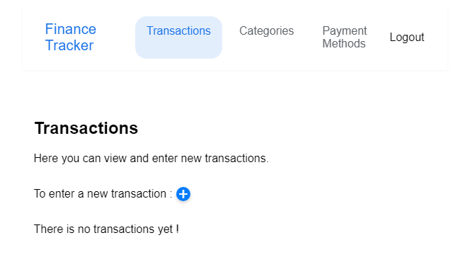
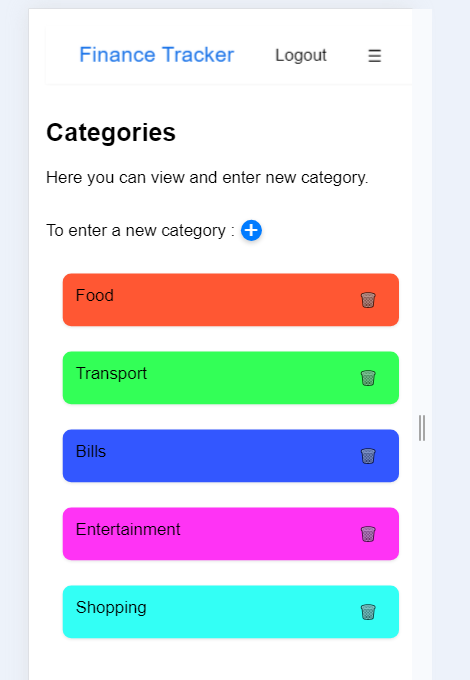

# Compte rendu Finance Tracker

## 1 Problèmes d’authentification

### Description du problème

#### Vue sur vidéo1 :
Sur la page d'accueil, l'utilisateur met un identifiant et un mot de passe, un loader s'affiche et tourne à l'infini. L'utilisateur n'a aucune information.

### Solutions proposées
Affichage d'un message d'erreur indiquant que l'identifiant ou le mot de passe est incorrect.

### Améliorations mises en place

Mise ne place d'un retour false en cas d'erreur.

```js linenums="1" filename="AuthContext.js"
const login = async (username, password) => {
    try {
        const data = await loginService.login(username, password);
        setAuth(data);
        return data;
    } catch (error) {
        console.error('Login failed:', error);
        // throw error;
        return false;
    }
};
```

## 2 Flux de création de transaction

### Description du problème

#### Vue sur vidéo3 :
L'utilisateur a la possibilité de commencer un parcours pour créer une transaction sans avoir créé au part avant un moyen de paiement. En fin de parcours, il doit changer d'onglet pour créer un moyen de paiement et perd tout ce qu'il avait renseigné.

### Solutions proposées
Mise en place d'un message alertant qu'il n'y a pas de moyen de paiement dans la fenêtre 

### Améliorations mises en place

```js
    <Modal
        isOpen={showNewForm}
        onClose={() => setShowNewForm(false)}
        title="New Transaction"
    >
    <form onSubmit={handleSubmit} className="transaction-form">
        {paymentMethods.length === 0 && (
            <div className="error">No payment methods available. Please add a payment method first.</div>
        )}
```

## 3 Problèmes de découvrabilité

### Description du problème

Le bouton pour créer une nouvelle entrée n'est pas clair ainsi que l'objectif de chaques sections.

### Solutions proposées

Mise en place de descriptifs pour toutes les sections.

### Améliorations mises en place



## 4.1 Réactivité mobile - menu

### Description du problème

La nav bar est trop grande, elle depasse de l'ecran.
Le contenu depasse de l'ecran, il est donc pas ateignable.

### Solutions proposées

Mise en place d'un menu burger

### Améliorations mises en place

Lien du menu burger à finaliser. Sa mise en place a permis de résoudre le problème de contenu qui dépasse.

## 5 Problèmes de session

### Description du problème

L’utilisateur est obligé de se connecter à chaque session.

### Solutions proposées



### Améliorations mises en place

a faire

## Problème 1

### Description du problème

### Solutions proposées

### Améliorations mises en place

## Problème 1

### Description du problème

### Solutions proposées

### Améliorations mises en place

## Problème 1

### Description du problème

### Solutions proposées

### Améliorations mises en place

## Problème 1

### Description du problème

### Solutions proposées

### Améliorations mises en place

## Problème 1

### Description du problème

### Solutions proposées

### Améliorations mises en place

## Problème 1

### Description du problème

### Solutions proposées

### Améliorations mises en place